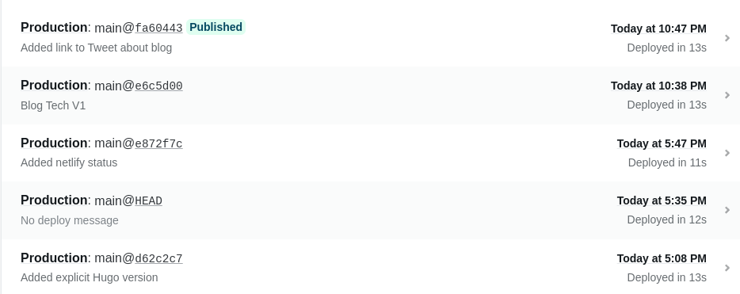

+++
author = "Eduan Bekker"
title = "Blog tech V1"
date = "2023-01-02"
description = "The core pieces of tech for the V1 of this blog"
tags = [
    "blogging",
    "netlify",
    "hugo"
]

+++

I always chuckle at meta content like "how much money I made on YouTube" and then "how much money I made with the how much money I make video".
Making videos about making videos. Some weird recursive feedback loop.

So yeah, here is my version of "what gear I use".

# GitHub
I'm a big fan of open source, so this blog is open source and hosted on GitHub. You can find it here: https://github.com/eduanb/eduanbekker.com
As for GitHub, I've extensively used most of its features with mixed feelings. Actions still have some major missing features, and their uptime in 2022 wasn't the best.
For V1 of this blog, GitHub is only used as a Git host.

Also, am I the only one feeling weird that most of the world's open source is hosted on a closed-source platform?
But for better or worse, it's where things are at, so I'll stick to it.

# Hugo
By choice, I am very inexperienced with frontend development. So my requirements were simple:
1. Open Source
2. Static. No backend for now. Keep it simple and cheap.
3. Good templates/themes to choose from
4. Uses markdown or AsciiDoc (no HTML/CSS)
5. Can run locally

Hugo fit all of those. I haven't even looked at alternatives.
I scrolled through the over 200 blogging temples, found one I liked and followed their instructions.
Here is the template I used: https://themes.gohugo.io/themes/hugo-clarity/

# Netlify
I think I saw someone recommend them on Twitter before. Forwarded that suggestion to a friend who now only has positive things to say about them.
So I finally gave it a try and I must say I'm impressed. Some positives so far:
1. Very generous free tier
2. One click linking to GitHub
3. First-class support for Hugo
4. Fast builds (~12s for build and deploy!)
5. Easy DNS and HTTPS setup

If you have a Hugo GitHub repo ready, deploying to production takes only 2 minutes from account creation.
My only complaint is that out of the box they use a very old version of Hugo which gave some weird errors.
Luckily you can easily config the version like I did here https://github.com/eduanb/eduanbekker.com/commit/d62c2c7f7f0799ce09f8f792cadddb06fb0a23af

 

---
